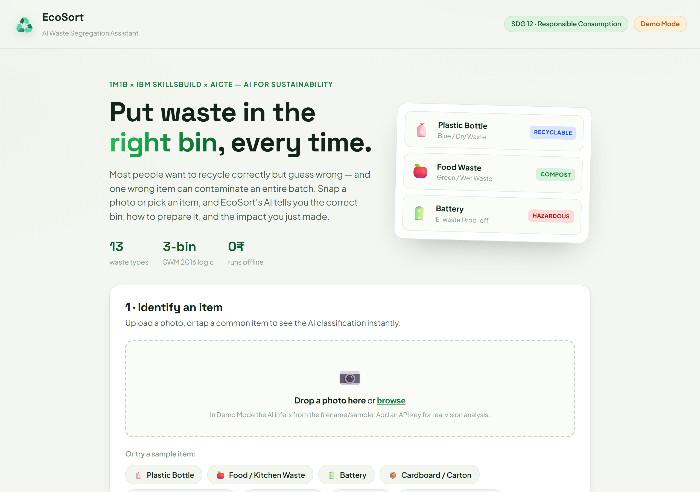
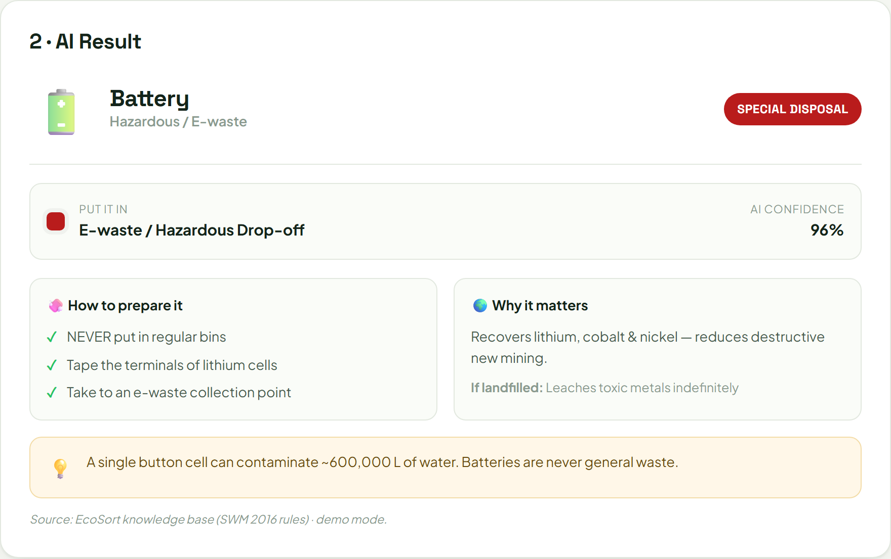
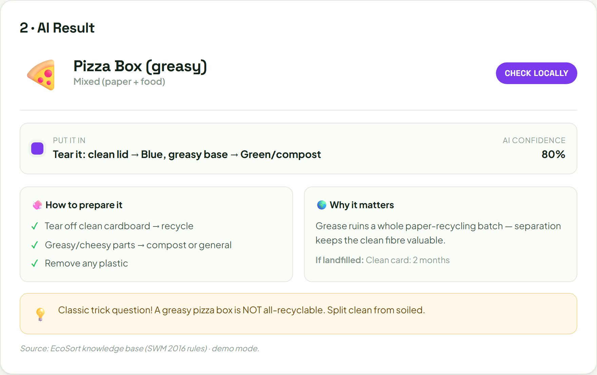
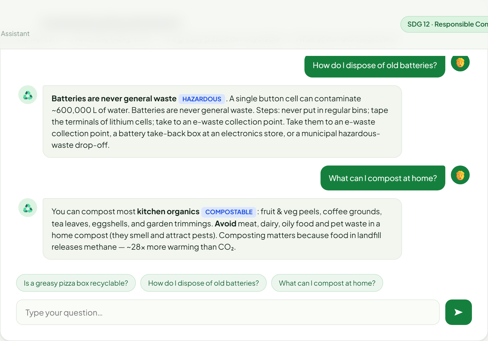
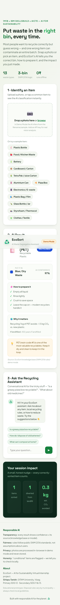

# ♻️ EcoSort — AI Waste Segregation Assistant

> **1M1B AI for Sustainability Virtual Internship** · in collaboration with **IBM SkillsBuild & AICTE**
> **Sirlapu Tanish**, GITAM University, Vizag
> **Primary SDG 12** · Responsible Consumption & Production (secondary: SDG 11 & 13)
>
> 🔗 **Live demo:** https://codex-ts.github.io/ecosort/ &nbsp;·&nbsp; **Repo:** https://github.com/codex-ts/ecosort

Most people *want* to recycle correctly — but guess wrong. One contaminated item
(a greasy box, a battery, a soft-plastic bag) can spoil an entire batch and send it
to landfill. **EcoSort** uses AI to tell anyone, instantly, **which bin an item belongs
in, how to prepare it, and the impact of getting it right.**



---

## ✨ What it does

| Feature | Description | AI element |
|---|---|---|
| 📷 **Photo classify** | Snap/upload a waste item → get its category, correct bin, prep steps, decomposition time & impact | Multimodal **vision classification** |
| 🧠 **Knowledge result card** | Transparent output with **confidence score** and **source** label | Structured, explainable output |
| 💬 **Recycling assistant** | Conversational AI for tricky cases ("greasy pizza box?", "old medicines?") | **Conversational AI** grounded in a waste KB |
| 🌍 **Impact tracker** | Honest, clearly-estimated CO₂ avoided, levels, history, export | Behavioural nudge |
| 🔍 **Library + search** | 28-item guide with search and outcome filters | Instant lookup |
| 🧪 **Quiz** | 5-question tricky-item quiz for demos | Engagement |
| 📦 **Bin guide** | 4-bin SWM 2016 visual guide | Education |

28 waste types, bin logic based on **India's Solid Waste Management Rules 2016**
(Green = wet · Blue = dry/recyclable · Red/Hazardous · dedicated E-waste).

---

## 🧩 Two modes, one interface

EcoSort is built so the **AI is only needed when you want it** (e.g. for testing/demo) —
the app is fully usable, free, and private without any key.

| Mode | How it runs | What powers the answers |
|---|---|---|
| **🟡 Demo Mode** (default) | Just open `index.html` — no key, no cost, fully offline | A curated knowledge base + keyword reasoning that mirrors the model's output shape |
| **🟢 Live AI Mode** (optional) | `node server.js` with an API key set | A real **Claude vision + chat model** classifies your actual photo and answers freely |

The UI is **identical** in both modes — the live model is prompted to return the exact
same structured fields the demo uses (see `server.js`).

---

## 🚀 Run it

### Demo mode (zero setup)
```bash
# Option A — just open the file
start index.html          # Windows

# Option B — serve it (recommended)
node server.js            # → http://localhost:3000
```

### Live AI mode (real vision, for testing)
```powershell
$env:ANTHROPIC_API_KEY = "sk-ant-..."      # your key
$env:ECOSORT_MODEL = "claude-opus-4-8"     # optional, this is the default
node server.js                              # badge flips to “Live AI”
```
Now uploading a photo sends it to the model, which returns a real classification.

> No build step, no dependencies — `server.js` is pure Node 18+ (built-in `http` + `fetch`).

---

## 🤖 AI elements & tools used

- **Multimodal vision classification** — Claude vision model identifies the item from a photo.
- **Conversational AI** — chat assistant for free-form recycling questions.
- **Prompt engineering** — a structured system prompt forces consistent, explainable JSON
  output and bakes in Responsible-AI behaviour (`server.js` → `CLASSIFY_PROMPT` / `CHAT_PROMPT`).
- **Knowledge-grounded fallback** — an offline KB (`js/knowledge.js`) built on SWM 2016 so the
  tool is accurate and usable without any model call.
- **Stack:** vanilla HTML/CSS/JS front end · zero-dependency Node backend · Anthropic Messages API.

---

## 🛡️ Responsible AI

- **Transparency** — every result shows a **confidence %** and whether it came from the
  knowledge base or the live model.
- **Fairness** — rules follow **public** SWM 2016 standards, not assumptions about users.
- **Honesty** — "conditional" items (cartons, soft plastic, pizza boxes) are flagged
  with *"check locally"* rather than over-claiming.
- **Privacy** — in demo mode photos are read **in-browser** and never uploaded or stored.
- **Scope safety** — the assistant redirects off-topic questions and avoids medical/legal overreach.

---

## 📸 Screenshots

| | |
|---|---|
|  |  |
|  |  |

See [`SUBMISSION.md`](SUBMISSION.md) for the full project write-up (problem statement,
design-thinking process, impact statement).

---

## 🗺️ Pages

| Page | What lives there |
|---|---|
| `index.html` | Home: hero, how-it-works, tricky items, quiz CTA, progress strip |
| `classify.html` | Search, photo upload + camera, samples, AI result card |
| `library.html` | Full 28-item searchable, filterable waste guide |
| `bins.html` | 4-bin SWM 2016 guide with dos and don'ts |
| `quiz.html` | 5-question quiz with persisted best score |
| `impact.html` | Levels, equivalents, history, copy/download report |
| `assistant.html` | Full-page recycling chat |
| `about.html` | Problem, AI approach, responsible AI, team |

Shared shell on every page: nav with active state, theme toggle, mode badge, footer. Impact history persists across pages on-device.

## 📁 Structure
```
index.html + classify/library/bins/quiz/impact/assistant/about.html
css/styles.css     eco-themed styling + dark mode + page sections
js/knowledge.js    28-item knowledge base + BIN_GUIDE + QUIZ (powers demo mode)
js/site.js         shared shell: nav, theme, mode badge, offline support
js/app.js          page-routed modules: classify, library, quiz, chat, impact
server.js          optional Node backend for real Claude AI (rate-limited, validated)
manifest.json      PWA manifest
sw.js              offline cache for all pages and assets
REVIEW_GUIDE.md    5-minute review demo script
docs/              screenshots
SUBMISSION.md      formal internship deliverable
```

---

*Educational prototype. Disposal rules vary by municipality — always check local guidelines.*
Built with responsible AI for the planet. ♻️
