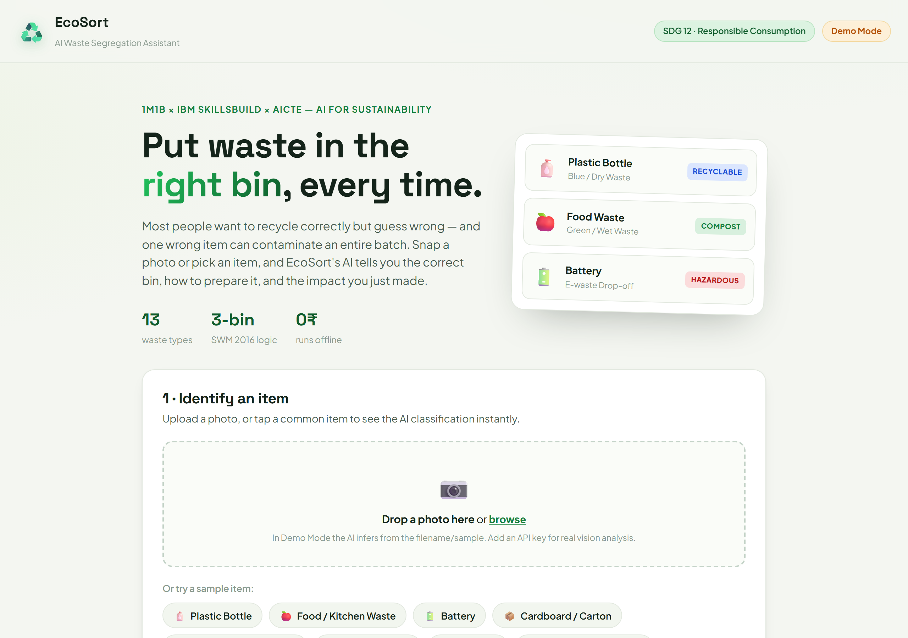
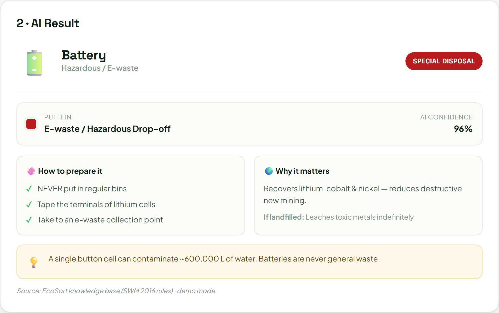
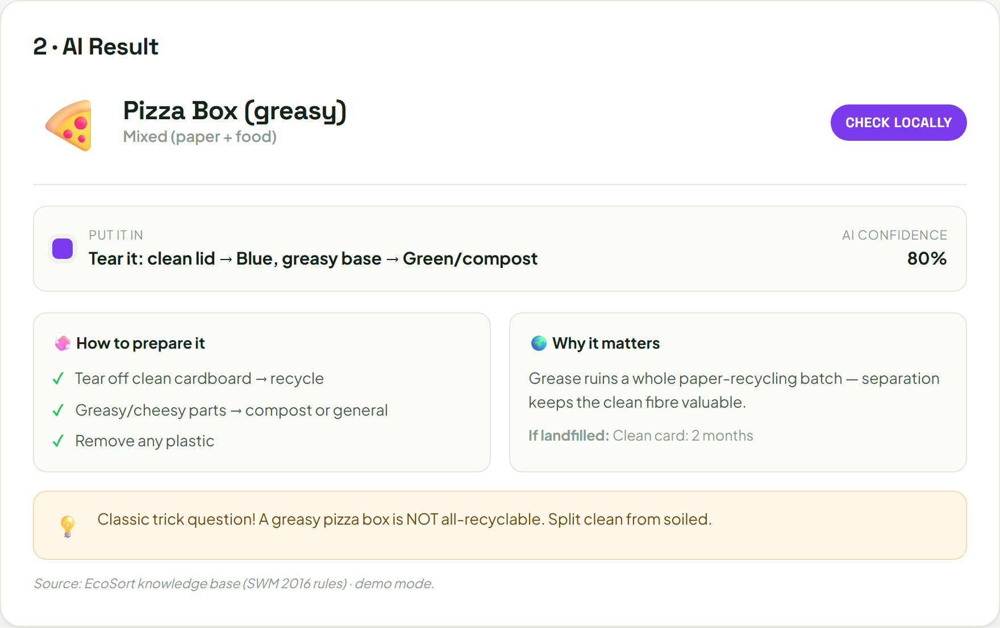
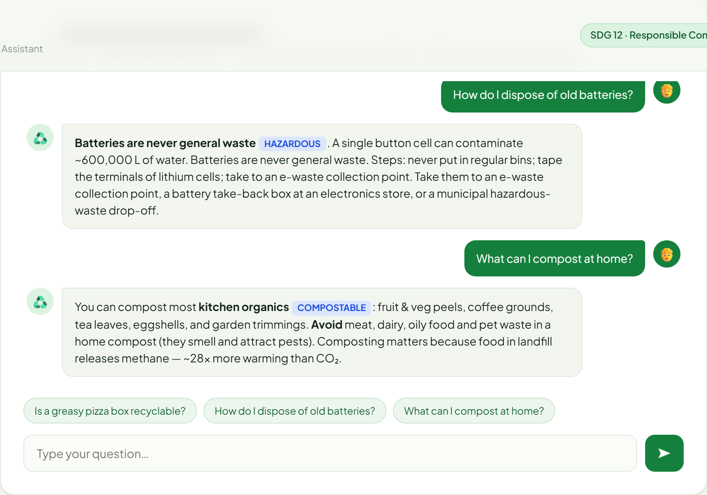
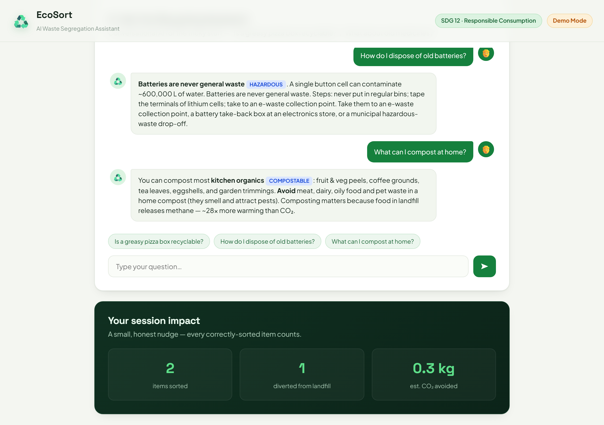
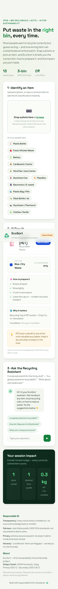

# EcoSort — AI Waste Segregation Assistant
### 1M1B AI for Sustainability Virtual Internship · IBM SkillsBuild & AICTE

---

## 1. Project Description

| Field | Detail |
|---|---|
| **Title** | EcoSort — AI Waste Segregation Assistant |
| **Student** | Sirlapu Tanish |
| **College** | GITAM University, Visakhapatnam (Vizag) |
| **Primary SDG** | **SDG 12 — Responsible Consumption & Production** |
| **Secondary SDGs** | SDG 11 (Sustainable Cities & Communities), SDG 13 (Climate Action) |
| **Category** | Decision-support tool + Conversational AI assistant |

---

## 2. Problem Statement

> **How might we use AI to help everyday people sort their waste correctly, so that
> household recycling and composting can become more accurate, less contaminated, and
> more sustainable?**

**The real-world problem.** Source segregation of waste fails not because people don't
care, but because they *don't know* where each item goes. Rules are inconsistent and
counter-intuitive: a greasy pizza box is half-recyclable, a battery is hazardous, soft
plastic bags jam recycling machines, and a "recyclable" symbol doesn't mean your city
accepts it. The result is **wish-cycling** — putting the wrong thing in the right bin —
which *contaminates entire batches* and sends otherwise-recyclable material to landfill.

**The scale.** India generates ~62 million tonnes of municipal solid waste a year, and
a large share that *could* be recycled or composted is lost to contamination at the very
first step: the household bin. Contamination rates in mixed recycling streams commonly
run 15–25%.

---

## 3. Who Is Affected (Target Users)

- **Households & students** who want to do the right thing but guess wrong.
- **Urban local bodies / municipalities** burdened by contaminated, unsortable waste.
- **Informal waste pickers** exposed to hazards (broken glass, batteries, e-waste) that
  shouldn't be in general bins.
- **The environment** — landfills emit methane from buried organics; mis-sorted
  recyclables waste the energy and water embodied in them.

---

## 4. Why AI Is Needed

A static poster or rulebook can't keep up with the variety of real items or answer a
person's specific question in the moment. AI adds value through:

- **Multimodal perception** — recognising an item from a *photo*, not a dropdown.
- **Instant, personalised guidance** — natural-language answers to "what about *this*?"
- **Scale & access** — the same expert advice for everyone, in plain language, for free.
- **Explainability** — a confidence score and the reasoning behind each verdict.

---

## 5. AI Solution Overview

EcoSort is a lightweight web app with three AI-driven parts:

1. **📷 Vision Classifier** — the user photographs a waste item; a **Claude vision model**
   identifies it and returns a structured result: category, correct bin (colour-coded to
   India's SWM 2016 rules), preparation steps, decomposition time, environmental impact,
   confidence score, and a practical tip.

2. **💬 Recycling Assistant** — a **conversational AI** grounded in a waste knowledge base
   answers the tricky, contextual questions ("Is a greasy pizza box recyclable?", "How do
   I dispose of old medicines?").

3. **🌍 Impact Tracker** — a transparent, clearly-*estimated* tally of items sorted and
   CO₂ avoided, used as a gentle behavioural nudge — never as a false-precision claim.

**Two modes for responsible, low-cost deployment:**
- **Demo Mode (default):** runs fully offline from a curated knowledge base — no API key,
  no cost, no data leaves the browser. Ideal for classrooms and low-connectivity settings.
- **Live AI Mode (optional):** with an API key, the same UI is powered by a real Claude
  vision + chat model. A carefully engineered system prompt forces the model to return the
  *same structured output* as the demo, so the experience is seamless.

> *Design-thinking note:* The project followed Empathise → Define → Ideate → Prototype →
> Test. The key insight from the Empathise stage — "people fail at the *first* step, the
> bin, not at the recycling plant" — is what focused the solution on point-of-disposal
> guidance rather than back-end sorting.

---

## 6. Responsible AI Considerations

| Principle | How EcoSort addresses it |
|---|---|
| **Transparency** | Every result shows a **confidence %** and a **source label** (knowledge base vs. live model). Users always know how sure the AI is. |
| **Fairness** | Bin rules are drawn from **public** Solid Waste Management Rules 2016 — not assumptions about a user's location, income, or behaviour. |
| **Ethics & Honesty** | "Conditional" items are explicitly flagged with *"check locally"* instead of over-claiming. The app never gives medical or hazardous-handling advice beyond standard disposal. |
| **Privacy** | In demo mode, photos are processed **in-browser** and never uploaded or stored. No personal data is collected. |
| **Scope safety** | The assistant politely redirects off-topic questions and stays within sustainability/waste guidance. |

---

## 7. Prototype / Demo

**Type:** Working interactive web prototype (front end) + optional live-AI backend.

- **Run (demo, no key):** `node server.js` → http://localhost:3000, or just open `index.html`.
- **Run (live AI — implemented; requires a key to exercise):** set `ANTHROPIC_API_KEY`, then `node server.js`.
- **Repository:** https://github.com/codex-ts/ecosort
- **Live demo (runs in demo mode):** https://codex-ts.github.io/ecosort/

**Prompt logic (the AI element), abbreviated** — from `server.js`:

```
SYSTEM (classify): "You are EcoSort, a waste-segregation vision assistant. Identify the
single main waste item and reply with ONLY JSON: { name, emoji, category,
recyclable: yes|compost|no|special|conditional|reuse, bin (SWM 2016 colours),
binColor, confidence 0-1, prep[], decompose, co2, tip }. If unclear, lower confidence
and say so. Never give medical/hazardous advice beyond standard disposal."

USER: [image] + "Classify this waste item."
```

### Screenshots

**Landing & classifier**


**AI result — a hazardous item (battery)**


**AI result — a "trick" conditional item (greasy pizza box)**


**Conversational recycling assistant**


**Impact tracker & Responsible-AI footer**


**Mobile view**



---

## 8. Workflow Diagram

```
                ┌─────────────────────────────────────────────┐
                │                  USER                        │
                │   photo of waste  ──or──  typed question     │
                └───────────────┬───────────────┬─────────────┘
                                │               │
                  ┌─────────────▼──┐      ┌──────▼───────────┐
                  │ VISION CLASSIFY │      │  CHAT ASSISTANT  │
                  └───────┬─────────┘      └──────┬───────────┘
                          │  (mode switch)        │
         ┌────────────────┴───────────┐  ┌────────┴─────────────┐
         │ DEMO: knowledge base       │  │ LIVE: Claude model    │
         │ (SWM 2016 rules, offline)  │  │ (vision + chat, key)  │
         └────────────────┬───────────┘  └────────┬─────────────┘
                          │  identical structured output
                          ▼
        ┌──────────────────────────────────────────────────────┐
        │  RESULT CARD: bin · prep steps · confidence · impact  │
        │  + impact tracker  + responsible-AI source label      │
        └──────────────────────────────────────────────────────┘
```

---

## 9. Impact Statement

**What changes if this is implemented?**
- Fewer mis-sorted items → **lower contamination** → more material actually recycled/composted.
- Organics diverted to compost → **less landfill methane** (methane is ~28× more warming
  than CO₂ over a 100-year horizon — and ~80× over 20 years).
- Hazardous items (batteries, e-waste) kept out of general bins → **safer waste pickers**
  and less soil/water pollution.

**Who benefits and how?**
- *Households* gain confidence and avoid fines/rejections.
- *Municipalities* receive cleaner, more valuable, more recyclable waste streams.
- *Waste pickers* face fewer hazards.
- *The planet* — every correctly-sorted item saves the embodied energy, water, and carbon
  of producing that material from scratch.

**Path to scale:** start as a campus/community web tool; integrate region-specific bin
rules; add local languages; partner with municipal apps for point-of-disposal guidance.

---

## 10. Links

- **GitHub repository:** https://github.com/codex-ts/ecosort
- **Live demo (GitHub Pages, demo mode):** https://codex-ts.github.io/ecosort/

> The live demo runs the offline demo-mode app on GitHub Pages — no server or key needed.
> To exercise **Live AI mode**, clone the repo and run `node server.js` with an
> `ANTHROPIC_API_KEY` set.

---

*EcoSort demonstrates that AI for sustainability doesn't have to be big or complex — it
has to be **clear, honest, and useful** at the exact moment a person makes a decision.*
